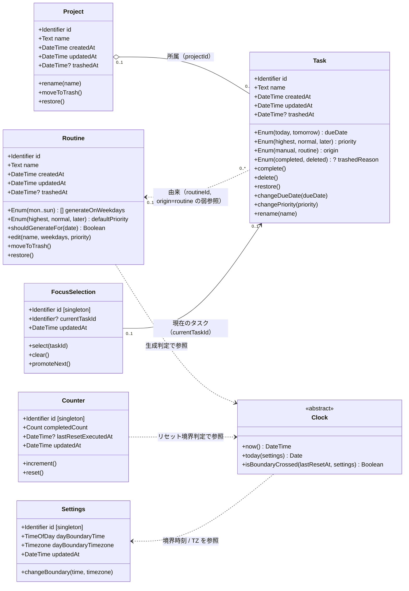
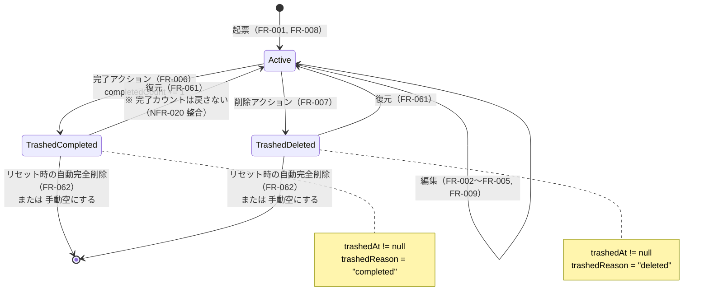
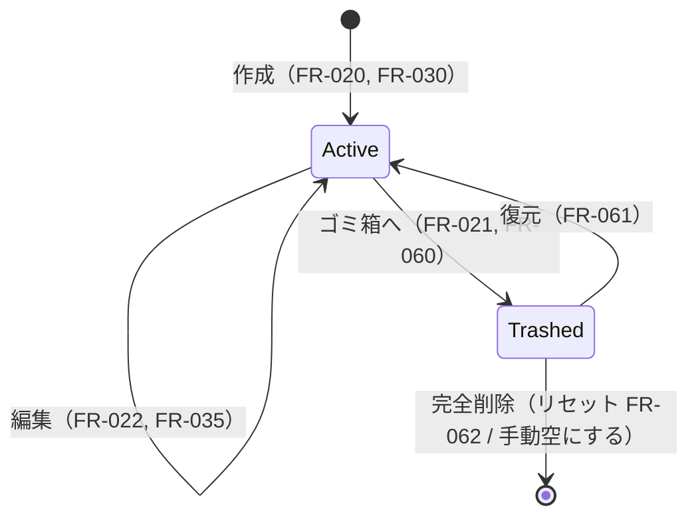
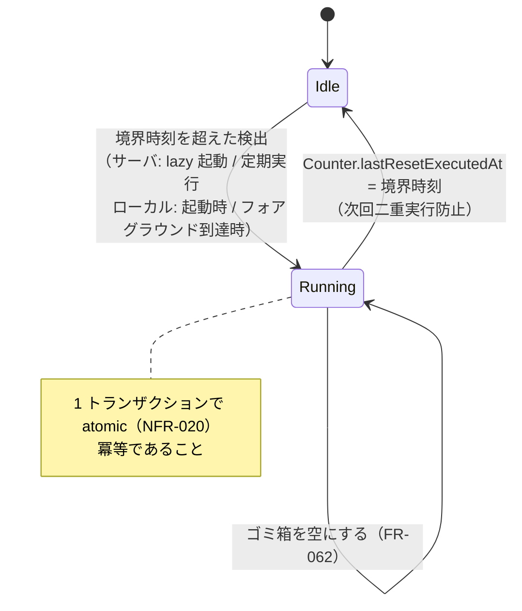

# ドメインモデル図

> Todica のドメインモデルを **クラス図** と **状態遷移図** で視覚化するドキュメント. 文字情報の論理スキーマは [`database/schema.md`](database/schema.md), モジュール境界は [`module-boundaries.md`](module-boundaries.md), 全体像は [`overview.md`](overview.md) を参照.
>
> 本書は技術非依存（tech-agnostic）の **概念モデル** を記述する. 具体的な型（string / number / UUID / 永続化機構ごとの型）には踏み込まない. 概念型のみで表現する.
>
> 本書と [`database/schema.md`](database/schema.md) は **論理スキーマの視覚版 / 文字版** の対の関係にある. フィールド定義の正本は schema.md 側. 本書は構造と関連を一目で掴むための補助.

## 1. 概念型の凡例

クラス図中で用いる属性の型は次の概念カテゴリに統一する.

| 概念型 | 意味 | 例 |
| --- | --- | --- |
| Identifier | エンティティを一意に識別する値 | Task の id, Project の id |
| Text | 人間が読み書きする短い文字列 | name |
| DateTime | タイムゾーンを含む日時 | createdAt, updatedAt, trashedAt |
| Date | 日付（時刻なし） | （現状未使用） |
| TimeOfDay | 時刻（日付なし） | dayBoundaryTime |
| Timezone | タイムゾーン識別子 | dayBoundaryTimezone |
| Count | 0 以上の整数値 | completedCount |
| Boolean | 真偽値 | （現状未使用） |
| Enum(...) | 列挙値. 取り得る値を括弧内に明示 | Enum(today, tomorrow) |
| 0..1 / 1 / 0..* | 多重度 | Project 0..1 Task, Routine 0..* Task |

- `?` を末尾に付けたものは「未設定（null 相当）を許容する」ことを示す.
- 本書は実装上の null 表現や永続化形式に踏み込まない.

## 2. ドメインクラス図

エンティティ間の関連と多重度を示す. 属性は概念型で表記する.

> **注**: 全エンティティが共通で持つ同期メタデータ（`version: integer`, `updatedAt: DateTime`）はクラス図上では省略する（[`database/schema.md`](database/schema.md) §同期メタデータ）.

### 2.1 関連の読み方

| 関連 | 多重度 | 種類 | 由来 |
| --- | --- | --- | --- |
| Project ↔ Task | 1 つの Project は 0 以上の Task を持つ. 1 つの Task は 0 または 1 つの Project に属する. | 集約（弱）. Task は Project 配下に **存在依存しない**（projectId が null でも成立, FR-001） | FR-001, FR-008, FR-020 |
| Routine ↔ Task | 1 つの Routine は 0 以上の Task を生成し得る. ルーティン由来 Task は 0 または 1 つの Routine を弱参照する. | 弱参照（履歴は持たない. FR-034） | FR-030, FR-031, FR-033 |
| FocusSelection → Task | 同時に 1 つだけ. 未選択時は参照なし. | 一意参照 | FR-012, FR-013 |
| Clock ← Routine / Counter / Settings | Clock 抽象を **参照** する（Clock は外部 I/O に依存しない純粋な抽象） | 依存関係 | NFR-020, ADR-0011 |

### 2.2 ゴミ箱を独立クラスにしない理由

- すべてのエンティティ（Task / Project / Routine）が `trashedAt` を持ち, **`trashedAt != null` をもってゴミ箱状態とみなす**（[`database/schema.md`](database/schema.md) 共通方針）.
- これにより, ゴミ箱は「`trashedAt` が立っているエンティティの集合」という **ビュー** として表現される. 独立した Trash エンティティは設けない.
- 復元（FR-061）は `trashedAt = null` への遷移として同一機構で扱える.
- 詳細な配置の議論は [`overview.md`](overview.md) §7.2 を参照.

### 2.3 シングルトン（単一レコード）エンティティ

- Counter / Settings / FocusSelection はそれぞれ **単一レコード**（固定 ID で表現）.
- 概念モデル上は通常のクラスとして扱うが, インスタンス数は常に 1 つ. クラス図のステレオタイプとして `[singleton]` を付して明示している.

## 3. 状態遷移図

### 3.1 Task のライフサイクル

Task は「通常状態」「ゴミ箱（完了）」「ゴミ箱（削除）」の 3 状態を取る. ゴミ箱からの脱出は **復元** によって通常状態へ戻るか, **物理削除**（リセット時の自動完全削除 / 手動空にする）で消滅する.

- ルーティン由来 Task が **当日中に未完了** のままリセットを迎えた場合は, 状態遷移上は「Active のまま破棄される」経路を取る（FR-033）. これは origin=routine かつ Active の Task を判定して物理削除する処理として実装され, ゴミ箱を経由しない例外経路となる. この経路は本図では省略している（リセットの全体は §3.3）.

### 3.2 Project / Routine のライフサイクル

Project と Routine は Task より単純. 「通常状態 ↔ ゴミ箱状態」の 2 状態を行き来し, 完全削除で消滅する.

- Project をゴミ箱に入れる際, 配下 Task はゴミ箱化せず `projectId` を `null` にする（**カスケード NULL 固定**. [`database/schema.md`](database/schema.md) §確定事項）. UI 確認やカスケード選択は無い. Project の復元はカスケード復元しない（`null` 化された `projectId` は元へ戻さない）. Project は `trashedReason` を持たない.
- Routine をゴミ箱に入れる際も同型に, 配下の未ゴミ箱 Task はゴミ箱化せず `routineId` を `null` にする（**デタッチ = カスケード NULL 固定**. 既にゴミ箱状態の Task には触れない）. Routine の復元はカスケード復元しない（`null` 化された `routineId` は元へ戻さない）. Routine は `trashedReason` を持たない. ゴミ箱状態の Routine は通常一覧および当日の生成対象判定から除外される.

### 3.3 リセット処理の全体（参考）

リセット処理は冪等であり, 境界時刻ごとに 1 度だけ実行される. 1 トランザクションで以下の状態遷移を atomic に行う（NFR-020）.

- 起動経路の詳細は [ADR-0011](../adr/0011-day-boundary-time-source.md), [`overview.md`](overview.md) §7.1 を参照.

## 4. 不変条件（invariants）

クラス図・状態遷移図に表れない補足のルール. 詳細は schema.md および各 FR を参照.

- **マルチユーザー前提のフィールドを持たない**（CORE-2 / [`database/schema.md`](database/schema.md) 共通方針）.
- **`origin = "routine"` の Task は `routineId` を弱参照として持つ**（履歴は持たない. FR-034）.
- **FocusSelection.currentTaskId が指す Task は Active であるべき**（ゴミ箱に入った瞬間に繰り上げが走る. FR-013）.
- **Counter / Settings / FocusSelection はインスタンス数 1**（固定 ID singleton）.
- **`trashedAt` と `trashedReason` は同時に意味を持つ**（一方だけが立つ状態は不正）.

## 5. 関連ドキュメント

- 論理スキーマ（フィールド定義の正本）: [`database/schema.md`](database/schema.md)
- アーキテクチャ全体像: [`overview.md`](overview.md)
- モジュール境界: [`module-boundaries.md`](module-boundaries.md)
- 境界時刻処理: [ADR-0011](../adr/0011-day-boundary-time-source.md)
