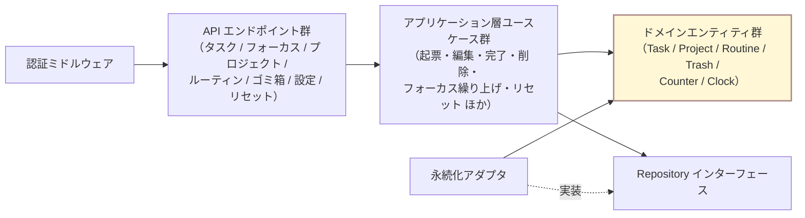
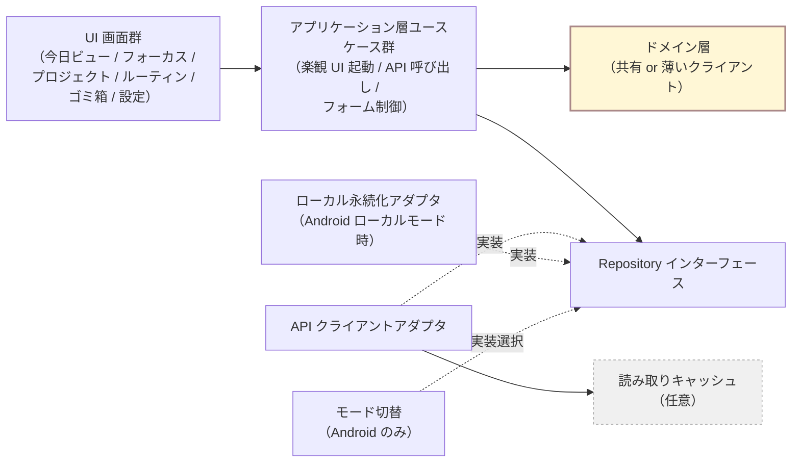

# モジュール境界

> Todica のモジュールの責務と, 依存してよい / いけない方向のルール. 「どこに何を書くか」で迷ったときの判断基準にする.
> 全体像は [`overview.md`](overview.md) を先に読むこと.
>
> 本書は技術非依存（tech-agnostic）の境界定義を記述する. 具体的なフレームワーク・ライブラリ・物理レイアウトはコンポーネント別の実装ドキュメント（[`server/`](server/) / [`web-client/`](web-client/) / [`android-client/`](android-client/) / [`api/`](api/) / [`database/`](database/)）を参照する.

## 1. 全体方針

Todica は **クライアント・サーバ型の 3 層構成** を取る（[ADR-0006](../adr/0006-distribution-topology.md)）.

- **サーバ**: 本人運用の単一インスタンス. Web / Android（サーバモード）の正本データを保持する.
- **Web クライアント**: 必ずサーバに接続する.
- **Android クライアント**: ローカルモード（端末内永続化）/ サーバモード（サーバ接続）を切替可能.

サーバ側もクライアント側も, 内部的にレイヤー分けして依存方向を制御する.

## 1.1 モジュール依存図（概念単位）

下図は本書で定める層・モジュールの依存方向を概念単位で示す. 具体的なディレクトリ名や実装名は出さず, **責務名** で書く. 実装上の物理レイアウトはコンポーネント別の実装ドキュメント（[`server/`](server/) / [`web-client/`](web-client/) / [`android-client/`](android-client/) / [`api/`](api/) / [`database/`](database/)）を参照.

### 1.1.1 サーバ側のモジュール依存

### 1.1.2 クライアント側のモジュール依存

- 実線は呼び出し方向（依存）. 点線はインターフェース実装関係および任意要素を示す.
- 上位レイヤから下位レイヤへの単方向のみ許可. 逆向き矢印は本書では存在しない（§5 依存ルール参照）.

## 2. サーバ側の層と責務

| 層 | 責務 | 知ってよいもの | 知ってはいけないもの |
| --- | --- | --- | --- |
| API レイヤ | クライアント要求受付・認証・バリデーション・入出力シリアライズ. アプリケーション層を呼ぶ. | アプリケーション層, 通信フレームワークの API | ドメイン内部ルール / 永続化 API / スキーマ詳細 |
| アプリケーション層 | ユースケース単位の手続き. ドメイン操作の組み合わせ・トランザクション境界の指定. | ドメイン層, データアクセス層のインターフェース, Clock | API レイヤ, 永続化アダプタの実装詳細 |
| ドメイン層 | エンティティ・状態遷移・ビジネスルール. 純粋ロジック. | 自身のエンティティ間関係, Clock の抽象 | 永続化, ネットワーク, UI, 具体的な時刻取得 |
| データアクセス層 | Repository インターフェース. ドメインの操作対象を永続化と切り離す. | ドメインのエンティティ | 永続化アダプタの具象, ネットワーク |
| 永続化アダプタ層 | 永続化機構を使った Repository の具象実装. | 永続化機構のクライアント, スキーマ詳細 | ドメインのビジネスルール（実行しない. 受け取って保存するだけ） |

依存方向は **API → アプリケーション → ドメイン ← データアクセス（インターフェース）← 永続化アダプタ（実装）**. ドメイン層は外側に依存しない（依存性逆転の原則）.

## 3. クライアント側の層と責務（Web / Android 共通）

| 層 | 責務 | 知ってよいもの | 知ってはいけないもの |
| --- | --- | --- | --- |
| UI 層 | 画面の描画とユーザー入力. アプリケーション層のユースケースを呼ぶ. 状態を購読して再描画する. | アプリケーション層, UI 用のローカル状態 | データソース実装（API クライアント / ローカル永続化）/ 時刻取得 API |
| アプリケーション層（クライアント） | ユースケース単位の手続き. 楽観 UI の起動・API 呼び出しオーケストレーション・フォーム制御. | データソース抽象（Repository インターフェース）, Clock 抽象 | UI 詳細, API クライアントの実装詳細 |
| データソース抽象 | サーバ API クライアントとローカル永続化アダプタの双方を同じインターフェースで扱う. | ドメインの DTO 型 | 具体的な実装（API / ローカル永続化）の中身 |
| API クライアントアダプタ（サーバモード時） | サーバ API への呼び出し. | 通信ライブラリ, 認証トークン | サーバ側のドメインロジック |
| ローカル永続化アダプタ（ローカルモード時. Android のみ） | 端末内永続化機構を Repository の具象として実装. リセット処理を端末内で実行する. | 端末内永続化機構, ローカル Clock | サーバ API |
| 読み取りキャッシュ（任意） | サーバから取得した状態を一時保持する. | クライアント側キャッシュ機構 | 書き込み系のドメインロジック |

依存方向は **UI → アプリケーション → データソース抽象 ← API クライアント / ローカル永続化アダプタ（実装）**.

クライアント側のドメイン層は **方針 Y を採用**.

- ドメインロジック（状態遷移・並び順計算など）を **共有部品**（TypeScript モジュール）として monorepo 内に置き, サーバ / Web クライアント / Android クライアント（サーバモード / ローカルモード）が同じドメイン層を使う.
- 共有モジュールは I/O を持たず純粋関数 + 型のみで構成する（プラットフォーム依存を持ち込まない）.
- これにより, ローカルモードの Android でもサーバと同じビジネスルールが動く（リセット冪等性 / 並び順 / フォーカス繰り上げ 等）.
- 採用しない方針 X（クライアント=薄い表示, ロジックはサーバ専任）はローカルモードの再実装コストが大きいため不採用.

## 4. モジュール一覧

> 以下の表は責務の境界を主眼とし, 各モジュールに対応する実装の物理パスを併記する（詳細レイアウトはコンポーネント別の実装ドキュメント [`server/`](server/) / [`web-client/`](web-client/) / [`android-client/`](android-client/) / [`api/`](api/) / [`database/`](database/) を参照）.

### 4.1 サーバ

| モジュール | 所属層 | 責務 | 依存してよい先 |
| --- | --- | --- | --- |
| `server/src/routers/*` | API レイヤ | 各エンドポイント（/tasks, /today, /focus, /projects, /routines, /trash, /counter, /settings, /reset 等）のリソース単位 HTTP ルータと入出力変換 | `server/src/app/*` |
| `server/src/middleware.ts` | API レイヤ | 認証トークン検証（Bearer → `sessions` 照合）ほかミドルウェア | （独立） |
| `server/src/app/task-usecases` | アプリケーション | 起票・編集・期限変更・優先度変更・完了・削除（FR-001 〜 FR-009, FR-014） | `domain/*`, `server/src/data/*`（インターフェース） |
| `server/src/app/focus-usecases` | アプリケーション | 現在のタスク選択・繰り上げ（FR-012, FR-013） | `domain/*`, `server/src/data/*` |
| `server/src/app/project-usecases` | アプリケーション | プロジェクト作成・編集・削除（FR-020, FR-022） | `domain/*`, `server/src/data/*` |
| `server/src/app/routine-usecases` | アプリケーション | ルーティン定義・編集・生成（FR-030, FR-031, FR-035） | `domain/*`, `server/src/data/*` |
| `server/src/app/trash-usecases` | アプリケーション | ゴミ箱の閲覧・復元・手動空にする（FR-061, FR-062） | `domain/*`, `server/src/data/*` |
| `server/src/app/reset-usecases` | アプリケーション | リセット処理オーケストレーション（FR-043, FR-051, FR-062, FR-033）. 本体は `server/src/use-cases/daily-reset.ts` / `purge-trash.ts` | `domain/*`, `server/src/data/*`, `Clock` |
| `server/src/app/settings-usecases` | アプリケーション | 境界時刻の設定（FR-042） | `domain/*`, `server/src/data/*` |
| `server/src/data/*` | データアクセス | Repository インターフェース群 | `domain/*` |
| `server/src/infra/persistence/drizzle/*` | 永続化アダプタ | 永続化機構を用いた Repository の具象（`drizzle-*-repository.ts`） | `server/src/data/*`, 永続化機構のクライアント |

### 4.2 ドメイン層（サーバ・クライアント共有候補）

| モジュール | 所属層 | 責務 | 依存してよい先 |
| --- | --- | --- | --- |
| `domain/src/task` | ドメイン | Task エンティティと状態遷移 | （内部のみ） |
| `domain/src/project` | ドメイン | Project エンティティ | `domain/src/task`（参照） |
| `domain/src/routine` | ドメイン | Routine エンティティと生成判定 | `Clock`（抽象） |
| `domain/src/trash` | ドメイン | ゴミ箱状態の表現と復元 / 完全削除のルール | `domain/src/task`, `domain/src/project` |
| `domain/src/counter` | ドメイン | 今日の完了数（FR-040） | `Clock`（抽象） |
| `domain/src/settings` | ドメイン | 境界時刻設定値の検証（FR-042） | （内部のみ） |
| `domain/src/focus-selection` | ドメイン | 現在のタスク参照と繰り上げ選択（FR-012, FR-013） | `domain/src/task`（参照） |
| `domain/src/clock` | ドメイン | 「現在時刻」「境界時刻判定」の抽象 | （他に依存しない） |

方針 Y を採る場合, このディレクトリは共通の共有モジュールとして置き, サーバ / クライアントが同じものを参照する.

### 4.3 Web クライアント

| モジュール | 所属層 | 責務 | 依存してよい先 |
| --- | --- | --- | --- |
| `web/src/ui/today-view` | UI | 今日ビュー（FR-010, FR-011） | `web/src/usecases/*` |
| `web/src/ui/tomorrow-view` | UI | 明日ビュー（FR-005, FR-014） | `web/src/usecases/*` |
| `web/src/ui/focus-view` | UI | 現在のタスク表示（FR-012, NFR-011） | `web/src/usecases/*` |
| `web/src/ui/projects-view` | UI | プロジェクト一覧 / 詳細（FR-020, FR-022） | `web/src/usecases/*` |
| `web/src/ui/routines-view` | UI | ルーティン定義（FR-030, FR-035） | `web/src/usecases/*` |
| `web/src/ui/trash-view` | UI | ゴミ箱（FR-060, FR-061, FR-062） | `web/src/usecases/*` |
| `web/src/ui/settings-view` | UI | 境界時刻設定（FR-042） | `web/src/usecases/*` |
| `web/src/usecases/*` | アプリケーション | 各ユースケース（サーバ側と同名の責務. TanStack Query mutation で楽観 UI 起動と API 呼び出し） | `domain/*`, `web/src/repositories/*` |
| `web/src/repositories/*` | データソース抽象 | Repository インターフェース群 + サーバ / ローカル両実装 | `domain/*` |
| `web/src/auth/authed-fetch.ts` | API クライアントアダプタ | サーバ API の呼び出し（認証ヘッダ付与）. 各 repository が直接利用 | 通信ライブラリ（fetch） |
| `web/src/query-client.ts` | 読み取りキャッシュ | TanStack Query のクライアント側キャッシュ機構 | （実装側裁量） |

### 4.4 Android クライアント

| モジュール | 所属層 | 責務 | 依存してよい先 |
| --- | --- | --- | --- |
| `android/ui/*` | UI | Web と同等の画面（共有実装の場合 Web と同コード）. 別実装の場合は同等画面を改めて実装. | `android/app/*` |
| `android/app/*-usecases` | アプリケーション | サーバ側と同名の責務. Web と共有可能な場合は共有する. | `domain/*`, `android/data/*` |
| `android/data/repositories` | データソース抽象 | Repository インターフェース群. サーバモード / ローカルモードで実装を切替. | `domain/*` |
| `android/infra/api-client` | API クライアントアダプタ（サーバモード時） | サーバ API の呼び出し | 通信ライブラリ |
| `android/infra/local-store` | ローカル永続化アダプタ（ローカルモード時） | 端末内永続化機構を Repository の具象として実装. リセット処理を端末内で実行. | 端末内永続化機構 |
| `android/infra/mode-selector` | モード切替 | 初回起動時または設定でモード（ローカル / サーバ）を選択・保存. | （独立） |

## 5. 依存ルール

### 5.1 共通

- **上位レイヤ → 下位レイヤのみ**. 逆流は禁止.
- **ドメイン層は外部 I/O（永続化・ネットワーク・UI・時刻取得 API 等）に直接依存しない**. 時刻が必要なら `domain/src/clock` を引数で受ける.
- **UI 層は直接 Repository / 永続化アダプタ / API クライアントを呼ばない**. 必ずアプリケーション層のユースケース経由.
- **永続化アダプタ / API クライアントアダプタはドメインのルールを実行しない**. 状態の保存・取り出し / 通信だけを担う.
- **横方向の参照は最小限**. 同一層内のモジュールどうしの参照は, 真に必要な場合に限る.

### 5.2 サーバ固有

- API レイヤから直接ドメイン / データアクセス層を呼ばず, **必ずアプリケーション層を経由する**.
- トランザクション境界はアプリケーション層が指定する. 永続化アダプタが具体的に開始・コミットする.
- 認証情報（認証トークン）の検証はミドルウェアで完結させ, アプリケーション層以降はマルチユーザー前提のロジックを持たない（CORE-2 と整合）.

### 5.3 クライアント固有

- **モード（ローカル / サーバ）の差異はデータソース抽象の実装入れ替えで吸収する**. UI / アプリケーション層はモードを直接 if 分岐しない.
- 楽観 UI は **アプリケーション層** で起動し, API 応答とキャッシュの整合は **データソース抽象 + 読み取りキャッシュ** で取る.
- 読み取りキャッシュは **書き込みの正本にしない**. 正本は常にサーバ（サーバモード）または端末内永続化機構（ローカルモード）.

## 6. 横断的関心事（cross-cutting）の置き場所

| 関心事 | 置き場所 | 補足 |
| --- | --- | --- |
| 現在時刻の取得 | `domain/src/clock`（抽象）+ 各層からの注入 | サーバ側はサーバ Clock, クライアント側はクライアント Clock を注入する（[ADR-0011](../adr/0011-day-boundary-time-source.md)） |
| 境界時刻の判定 | `domain/src/clock` | 「今日 / 翌日」判定はすべてここを介す |
| リセット処理のオーケストレーション | サーバ側 `server/src/app/reset-usecases`（本体は `server/src/use-cases/daily-reset.ts` / `purge-trash.ts`）, ローカルモード Android 側 `web/src/usecases/local-reset-usecase.ts`（web 実装を共有） | 起動経路は ADR-0011 参照 |
| トランザクション境界 | アプリケーション層が指定し, 永続化アダプタが実装 | 1 ユースケース = 1 トランザクションを基本に, 整合性要件（NFR-020）を満たす |
| ゴミ箱経由処理 | `domain/src/trash` + 各エンティティの「ゴミ箱状態」 | すべての削除・完了はゴミ箱経由（FR-060） |
| 認証 | サーバ: `server/src/middleware.ts` が `sessions` テーブル参照で token 検証. クライアント: ログインで取得した opaque token を localStorage / Preferences に保管しリクエストヘッダ付与 | パスワード bcrypt 照合で発行する opaque token を Bearer で送る方式（[ADR-0010](../adr/0010-api-design.md), [`api/overview.md`](api/overview.md) §3） |
| エラー表現 | ドメイン層は例外を投げず, 値（Result 型相当）で表すことを推奨. API レイヤで通信規約上のエラーへ変換. クライアント UI で人間向けメッセージに変換. | |

## 7. 境界をまたぐ際の約束

- **入力 / 出力の型**: 層をまたぐ際は, 層の言葉（ドメインのエンティティ, DTO, ユースケース引数 / 戻り値）に変換する. UI のフォーム状態をそのままドメインに渡さない.
- **時刻**: 層をまたぐ時刻は ISO 8601 文字列または明示的な「タイムゾーン込みの値」とする. 表現の暗黙の取り扱いを禁止する.
- **永続化のキー**: ドメイン層がエンティティ ID を生成側で決められること（永続化アダプタに自動採番させない. テスト容易性とリセット冪等性のため）.
- **通信スキーマ**: API レイヤとクライアントの間で交換する表現は OpenAPI 定義（[`api/openapi.yaml`](api/openapi.yaml)）に一元化する. 具体的なシリアライズ形式は [`api/overview.md`](api/overview.md) を参照.

## 8. 物理構成

実装時の物理的なディレクトリレイアウト・モジュール分割の方針は, コンポーネント別の実装ドキュメント（[`server/`](server/) / [`web-client/`](web-client/) / [`android-client/`](android-client/) / [`api/`](api/) / [`database/`](database/)）を参照する. monorepo を採るか, ポリレポにするかは implementer の判断とする.

## 9. 「ここまでが architecture, ここから先が feature spec」

本書では次までを定める.

- サーバ / クライアントの層分け・依存方向・モジュール単位の責務.
- 横断的関心事の置き場所.
- ローカル / サーバ モード切替の抽象（データソース抽象を 1 段噛ませる）.

次は feature spec で定める.

- 具体的なユースケースの引数 / 戻り値.
- 画面の UI 仕様（レイアウト・操作シーケンス）.
- 個別のエラーメッセージ・バリデーション規則.
- 個別 API エンドポイントのリクエスト / レスポンススキーマ.
- 楽観 UI のロールバック条件・再試行 UI の挙動.
- Android モード切替の具体的操作フロー.
- ライブラリ選定（状態管理・Repository ラッパー・テストランナー 等）.
