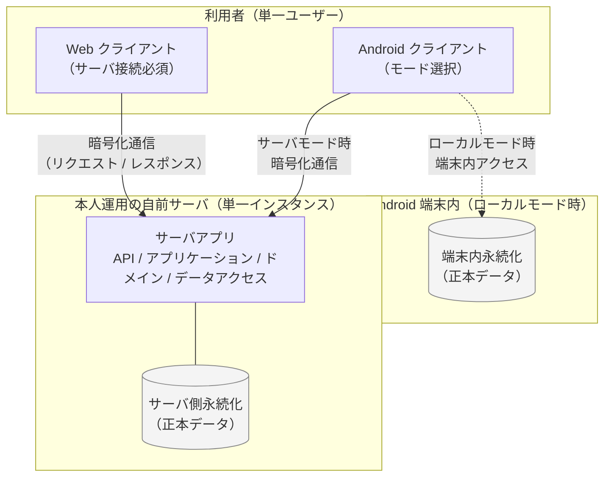
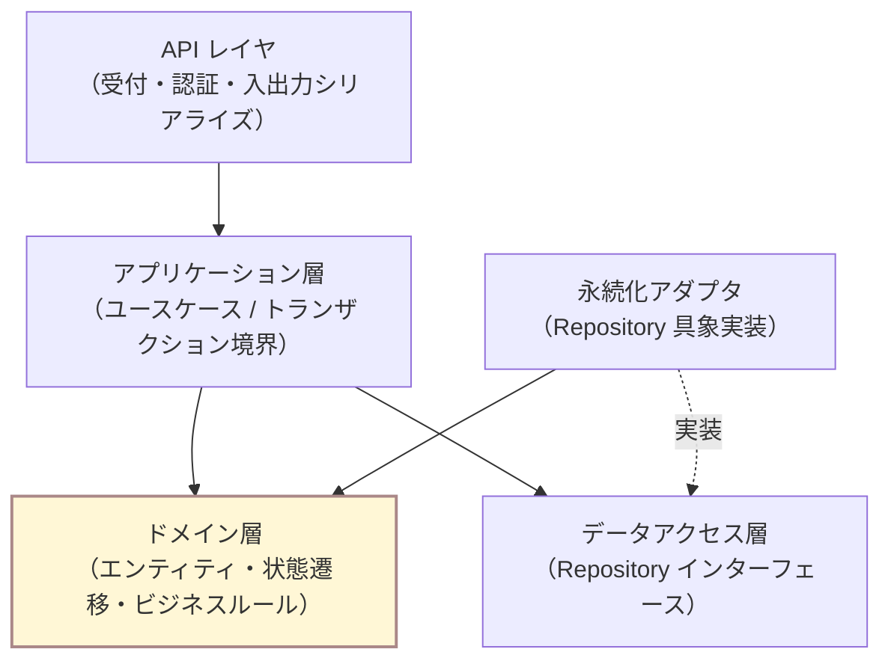
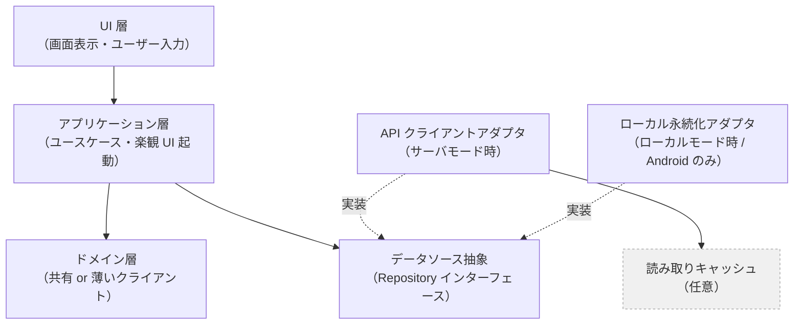

# アーキテクチャ概要

> Todica のシステム全体像を 1 ページで掴むためのドキュメント. モジュールの責務・依存ルールは [`module-boundaries.md`](module-boundaries.md), データの形は [`database/overview.md`](database/overview.md) を参照.
>
> 本書は **「各 feature spec が共通基盤に乗って書けるようにする」** ことを目的とする軽量な基本設計である. 個別機能の挙動は本書には書かない（それは `features/<name>/spec.md` の役割）.
>
> **本書は技術非依存（tech-agnostic）の抽象アーキテクチャを記述する.** 採用技術・ライブラリ・プロトコルなどの具体は, コンポーネント別の実装ドキュメント（[`server/`](server/) / [`web-client/`](web-client/) / [`android-client/`](android-client/) / [`api/`](api/) / [`database/`](database/)）に分離する.

## 1. 位置づけと前提

- 上位文書: [`../project.md`](../project.md) / [`../requirements.md`](../requirements.md)
- 主要前提（要件由来）
  - 単一ユーザーでの利用（NFR-002, project.md §3 CORE-2, §8 In Scope "単一ユーザーでの利用"）.
  - データの場所やアクセスする端末を制限しない（NFR-021）.
  - 共有 SaaS としてのホスティングは提供しない（OOS-012, project.md §8 Out of Scope）.
  - Web と Android の 2 配布形態（requirements.md §4）.
  - 個人 1 人開発・個人負担コスト（CONSTRAINT-001, NFR-032）.
  - リセット処理が中断・再起動を挟んでも整合的であること（NFR-020, FR-043, FR-051）.

## 2. 構成方針（ADR-0006 に基づく）

Todica は **クライアント・サーバ型の 3 層構成** を取る.
ただしサーバは「本人運用の単一インスタンス」で, マルチテナント・共有 SaaS にはしない（project.md §8 Out of Scope 遵守）.

- **Web クライアント**: 必ず自前サーバに接続する. ブラウザ単独でデータを完結させない（オフライン時の読み取りキャッシュは許容. 詳細は [ADR-0008](../adr/0008-web-client-tech-stack.md)）.
- **Android クライアント**: 起動時または設定でモードを選ぶ. (いつでも変更可能だが, データの同期はしない)
  - **ローカルモード**: 端末内の永続化機構に閉じる. サーバを使わない. Web とは独立.
  - **サーバモード**: Web と同じ自前サーバに接続する. Web と同じデータを見る.
- **自前サーバ**: 本人運用の単一インスタンス. Web / Android（サーバモード）の保存先. 認証は最小限の単一アカウント.

詳細決定は次の ADR を参照.

- [ADR-0006](../adr/0006-distribution-topology.md): 配布構成の再定義
- [ADR-0007](../adr/0007-server-tech-stack.md): サーバ側技術スタック
- [ADR-0008](../adr/0008-web-client-tech-stack.md): Web クライアント技術スタック
- [ADR-0009](../adr/0009-android-client-tech-stack.md): Android クライアント技術スタック
- [ADR-0010](../adr/0010-api-design.md): API 設計の方針
- [ADR-0011](../adr/0011-day-boundary-time-source.md): 境界時刻処理の時刻基準

## 3. システム構成図（全体像）

### 3.1 システムトポロジ

クライアント・サーバ型の 3 要素（Web クライアント / Android クライアント / 自前サーバ）と, データの所在・通信線を示す. Android はモード選択により接続先が切り替わる.

- Web は **サーバ接続必須**. オフライン時は最後に取得したキャッシュを表示する程度の耐性を持つ（書き込みは原則サーバの確認応答を必要とする）.
- Android は **モード選択** によりサーバ接続するかローカル完結するかが切り替わる. サーバモードとローカルモードのデータは独立（同期しない）.
- サーバとクライアントの間は暗号化された通信路で守る（[ADR-0010](../adr/0010-api-design.md)）.

### 3.2 サーバ内部の層構造

サーバ内部はレイヤー分けされ, 依存方向は上から下へ単方向. ドメイン層は外部 I/O を知らない（依存性逆転）.

- 矢印は依存方向（呼び出し方向）. 点線は「インターフェースを実装する」関係.
- ドメイン層は最下位ではなく中央. 上位（アプリケーション層）も下位（永続化アダプタ）もドメイン層に依存する.

### 3.3 クライアント内部の層構造

Web / Android（サーバモード）/ Android（ローカルモード）に共通する層. データソース抽象により, API クライアントとローカル永続化アダプタを差し替え可能にする.

- モード（ローカル / サーバ）の差異はデータソース抽象の実装入れ替えで吸収する. UI / アプリケーション層はモードを直接 if 分岐しない（[`module-boundaries.md`](module-boundaries.md) §5.3）.

## 4. コンポーネントと実装ドキュメント

抽象アーキテクチャ上のコンポーネントは, それぞれ「採用技術 / 実装上の注意」を別ドキュメントで持つ. 本書では責務のみを示し, 技術名は実装ドキュメントを参照する.

| コンポーネント | 抽象上の責務 | 実装ドキュメント |
| --- | --- | --- |
| サーバ | クライアントからの要求を受け, 永続化された正本データを操作・返却する | [`server/overview.md`](server/overview.md) |
| Web クライアント | サーバへ接続して操作・表示を行う | [`web-client/overview.md`](web-client/overview.md) |
| Android クライアント | サーバモード / ローカルモードを切替可能なモバイル UI | [`android-client/overview.md`](android-client/overview.md) |
| API | サーバとクライアントの間の通信契約 | [`api/overview.md`](api/overview.md) |
| 永続化機構 | サーバ側・Android ローカルモード側双方のデータ正本を保持する | [`database/overview.md`](database/overview.md) |

具体的なライブラリ・ツールは各コンポーネント別実装ドキュメントで確定済み:
- サーバ: Hono + better-sqlite3 + drizzle-orm + Vitest + Biome（[`server/overview.md`](server/overview.md), [`database/overview.md`](database/overview.md)）
- Web クライアント: React + Vite + PWA + TanStack Query + React Router + Vitest + Biome（[`web-client/overview.md`](web-client/overview.md)）
- Android クライアント: Capacitor + @capacitor-community/sqlite + 上記 Web 実装を共有（[`android-client/overview.md`](android-client/overview.md)）

## 5. 層構成と責務（サーバ / クライアント）

詳細は [`module-boundaries.md`](module-boundaries.md). ここでは概観のみ.

### 5.1 サーバ

| 層 | 責務 | 代表的な構成要素 |
| --- | --- | --- |
| API レイヤ | クライアントからの要求受付・認証・バリデーション・入出力シリアライズ. アプリケーション層を呼ぶ. | エンドポイント, 認証ミドルウェア |
| アプリケーション層 | ユースケース単位の手続き. 複数のドメイン操作とトランザクション境界を取りまとめる. | 「タスクを起票する」「リセットを実行する」など |
| ドメイン層 | エンティティ・ビジネスルール・状態遷移. 外部 I/O を知らない. | Task / Project / Routine / Trash / Counter / Clock |
| データアクセス層 | Repository インターフェース. ドメインの操作対象を永続化と切り離す. | TaskRepository ほか |
| 永続化アダプタ | 永続化機構を用いた Repository の具象実装. | 永続化アダプタ |

### 5.2 Web クライアント / Android（サーバモード）

| 層 | 責務 | 代表的な構成要素 |
| --- | --- | --- |
| UI 層 | 画面表示・ユーザー入力. アプリケーション層（クライアント側）を介してのみ状態を更新する. | 今日ビュー / 現在のタスク / プロジェクト / ルーティン / 設定 |
| アプリケーション層 | クライアント側ユースケース（フォーム制御・楽観 UI 起動・API 呼び出しオーケストレーション）. | 「タスク起票フォーム」「タスク完了アクション」など |
| データソース抽象（Repository インターフェース） | サーバ API クライアントとローカルキャッシュ / ローカル永続化機構の双方を同じインターフェースで扱う. | TaskRepository ほか |
| API クライアントアダプタ | サーバ API への呼び出し. | API クライアント |
| 読み取りキャッシュ（任意） | サーバから取得した状態を一時保持. | クライアント側キャッシュ |

### 5.3 Android（ローカルモード）

| 層 | 責務 | 代表的な構成要素 |
| --- | --- | --- |
| UI 層 | サーバモードと共通 | サーバモードと共通 |
| アプリケーション層 | サーバモードと共通（同じユースケース層を再利用） | サーバモードと共通 |
| データソース抽象 | サーバモードと共通インターフェース | サーバモードと共通 |
| ローカル永続化アダプタ | 端末内の永続化機構を Repository の具象として実装. リセット処理を端末内で実行する. | 端末内データストアの具象 |

依存方向は **UI → アプリケーション → ドメイン ← データアクセス（インターフェース）← 永続化 / API アダプタ（実装）**. ドメイン層は外側を知らない（依存性逆転）. サーバ側 / クライアント側ともに同じ依存方向を取る.

## 6. データ流れ

### 6.1 サーバモード時のタスク完了

1. UI 層（クライアント）: 「現在のタスクを完了」ボタンが押される.
2. アプリケーション層（クライアント）: 「タスク完了」ユースケースを起動する. 楽観 UI で即座に表示を更新.
3. API クライアントアダプタ: サーバへ「タスク完了」要求を送る.
4. API レイヤ（サーバ）: 認証・バリデーションを行い, アプリケーション層を呼ぶ.
5. アプリケーション層（サーバ）: 「タスク完了」ユースケースを起動. ドメイン層で状態遷移ルール（完了 → ゴミ箱）を適用. 完了数カウントを +1. フォーカス繰り上げ（FR-013）を計算.
6. データアクセス層 → 永続化アダプタ: 1 トランザクションで「Task のゴミ箱化」「カウント +1」「フォーカス更新」を atomic に書く（NFR-020）.
7. サーバから新しい状態を返す. クライアントは楽観 UI とサーバ応答が一致することを確認し, 必要ならキャッシュを正本に置き換える.

### 6.2 ローカルモード時のタスク完了

1. UI 層 → アプリケーション層 → ドメイン層 → データアクセス層 → 端末内永続化アダプタ.
2. すべて端末内で 1 トランザクションで完結する.

## 7. 横断的関心事

### 7.1 境界時刻処理（リセット）

詳細は [ADR-0011](../adr/0011-day-boundary-time-source.md).

- 「今日」と「翌日」を切り替える境界時刻はユーザー設定値（FR-041, FR-042）.
- **サーバモード時**: サーバ時刻を正本とする. リセット処理はサーバ側で実行する.
  - 「lazy 起動」: 次のクライアントアクセス時に, 未実行の境界時刻があれば実行.
  - 必要に応じて定期実行で補強.
- **ローカルモード時**: クライアント時刻を正本とする. リセット処理はクライアントアプリ内で実行する.
  - 「アプリ起動時」「フォアグラウンド境界時刻到達時」の両経路を持つ.
- リセット処理本体は次を atomic に行う（NFR-020）.
  - 完了数カウントを 0 にする（FR-043）.
  - 未完了の通常タスクを翌日仕様で繰り越す（FR-051）. ルーティン由来タスクは持ち越さない（FR-033）.
  - 当日生成すべきルーティン由来タスクを生成する（FR-031）.
  - ゴミ箱を空にする（FR-062）.
- リセット処理は **冪等** であること. 「最後にリセットした境界時刻」を永続化し, 二重実行を防ぐ.

### 7.2 ゴミ箱経由処理

- すべての削除・完了はゴミ箱を経由する（FR-060）.
- ドメイン層で **Trash エンティティ** を独立に持つのではなく, 各エンティティが「ゴミ箱状態にあるか」を表現できる構造とする（詳細は [`database/schema.md`](database/schema.md)）.
- 復元（FR-061）は「ゴミ箱状態を解除する」操作としてアプリケーション層に置く.

### 7.3 「今日」の判定

- 「タスクの期限が今日か」「ルーティンを今日生成すべきか」などの判定はすべて Clock 抽象を介す.
- サーバモードではサーバの Clock, ローカルモードでは端末の Clock を実装として注入する.
- UI 層やデータアクセス層が直接プラットフォーム提供の時刻 API を呼ばない（テスト容易性 / 一貫性のため）.

### 7.4 認証・通信

- 認証は単一認証トークン（推奨案. [ADR-0010](../adr/0010-api-design.md)）.
- 暗号化された通信路を必須とする. 終端方法は実装ドキュメントを参照.
- マルチテナント化しない. ユーザー ID / テナント ID をスキーマに持たない.

### 7.5 オフライン耐性（Web / Android サーバモード）

- **配信**: PWA としてインストール可能. Service Worker でシェル（HTML/JS/CSS）を pre-cache し, オフラインでも起動できる（[ADR-0008](../adr/0008-web-client-tech-stack.md)）.
- **読み取り**: TanStack Query のメモリキャッシュ + Service Worker のキャッシュで耐える. 通信復帰後にサーバ最新を再取得.
- **書き込み**: クライアント側 IndexedDB に **書込キュー** を保持し, 接続復帰時に **Background Sync API** で自動再送する.
  - 全書き込み API は `Idempotency-Key` ヘッダ必須（[ADR-0010](../adr/0010-api-design.md)）. 値はエンティティ ID（UUID v4）. 再送による二重登録を防ぐ.
  - 更新系 API は `If-Match: <version>` で楽観ロック. 不一致なら 412 Precondition Failed が返る.
  - 競合時はサーバ値をユーザーに提示し, 「サーバ値で上書き / クライアント値を強制再送」のどちらにするかを選んでもらう.
- Android ローカルモードはサーバを使わないため上記キュー不要. 端末内 SQLite に直接書き込む.

## 8. UI アーキテクチャの輪郭

主要画面（概念単位. 名称や詳細は feature spec で確定）.

| 画面 | 役割 | 由来 |
| --- | --- | --- |
| 今日ビュー | アプリの入口. 期限=今日のタスクを優先度順に並べる. | FR-010, FR-011 |
| 現在のタスク（フォーカス） | 1 つだけを大きく表示する. | FR-012, NFR-011 |
| プロジェクト一覧 / プロジェクト詳細 | プロジェクト単位の管理. | FR-020, FR-022 |
| ルーティン定義 | ルーティンの作成・編集. | FR-030, FR-035 |
| ゴミ箱 | ゴミ箱の閲覧・復元・手動空にする. | FR-060, FR-061, FR-062 |
| 設定 | 境界時刻の設定. Android はモード設定も含む. | FR-042, NFR-012 |

画面遷移の大枠: 入口は今日ビュー. 今日ビューからフォーカス（現在のタスク）へ 1 ホップで到達できる. プロジェクト・ルーティン・ゴミ箱・設定は二級導線とし, 今日ビューを邪魔しない位置に置く（NFR-001 単一ワークフロー / NFR-011 単独大表示と整合）.

## 9. API の位置づけ

Todica は **本人運用サーバとそのクライアントの間の内部 API** を持つ（[ADR-0010](../adr/0010-api-design.md)）.

- 共有 SaaS としての外部公開 API は持たない（project.md §8 Out of Scope "共有 SaaS としてのホスティング提供"）.
- API の方針・主要リソース概観・具体的なプロトコル表現は [`api/overview.md`](api/overview.md). スキーマ定義は [`api/openapi.yaml`](api/openapi.yaml).

## 10. 主要な設計判断（ADR 一覧）

| ADR | 内容 | 状態 |
| --- | --- | --- |
| [0003](../adr/0003-tech-stack-web-first.md) | 技術スタック選定（旧 Web 単体前提） | 廃止（→ 0008 / 0009） |
| [0004](../adr/0004-persistence-mechanism.md) | 永続化方式選定（旧 IndexedDB） | 廃止（→ 0007 / 0009） |
| [0005](../adr/0005-no-external-api.md) | 外部 API を持たない | 廃止（→ 0010） |
| [0006](../adr/0006-distribution-topology.md) | 配布構成の再定義（クライアント・サーバ型） | 承認（2026-06-07） |
| [0007](../adr/0007-server-tech-stack.md) | サーバ側技術スタック | 承認（2026-06-07） |
| [0008](../adr/0008-web-client-tech-stack.md) | Web クライアント技術スタック（PWA） | 承認（2026-06-07） |
| [0009](../adr/0009-android-client-tech-stack.md) | Android クライアント技術スタック（Capacitor） | 承認（2026-06-07） |
| [0010](../adr/0010-api-design.md) | API 設計の方針（REST + Bearer + 冪等性 + 楽観ロック） | 承認（2026-06-07） |
| [0011](../adr/0011-day-boundary-time-source.md) | 境界時刻処理の時刻基準（T3 ハイブリッド） | 承認（2026-06-07） |

## 11. 関連ドキュメント

- モジュール境界（抽象）: [`module-boundaries.md`](module-boundaries.md)
- ドメインモデル図（クラス図 / 状態遷移図）: [`domain-model.md`](domain-model.md)
- コンポーネント別実装ドキュメント: [`server/overview.md`](server/overview.md), [`web-client/overview.md`](web-client/overview.md), [`android-client/overview.md`](android-client/overview.md), [`database/overview.md`](database/overview.md), [`api/overview.md`](api/overview.md)
- データベース: [`database/overview.md`](database/overview.md), [`database/schema.md`](database/schema.md), [`database/migration-policy.md`](database/migration-policy.md)
- API: [`api/overview.md`](api/overview.md), [`api/openapi.yaml`](api/openapi.yaml)
- ADR: [`../adr/`](../adr/)
